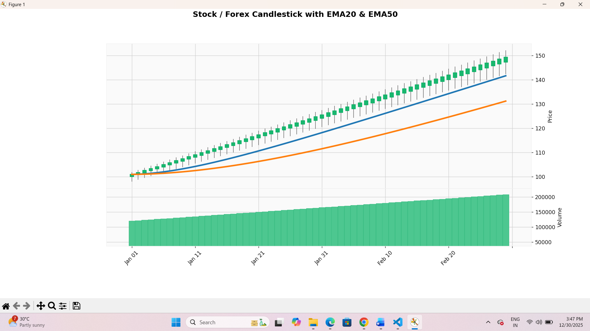

# Stock & Forex Market Visualization System

A Python-based financial market technical analysis project that
visualizes stock/forex price data using candlestick charts and technical
indicators such as **EMA20, EMA50, and RSI (14)**.

## Project Overview

This project reads historical market data from a CSV file and performs
technical analysis to identify possible **BUY** and **SELL** signals.

### Key Features

-   Loads market data from `market_data.csv`
-   Converts and uses the `Date` column as the time index
-   Calculates **20-period Exponential Moving Average (EMA20)**
-   Calculates **50-period Exponential Moving Average (EMA50)**
-   Calculates **14-period Relative Strength Index (RSI)**
-   Displays stock/forex **candlestick charts**
-   Displays **trading volume**
-   Uses EMA crossover and RSI conditions for BUY/SELL signal generation
-   Prints generated trading signals with Close price, EMA20, EMA50,
    RSI, and Signal

## Technologies Used

-   **Python**
-   **Pandas** -- data loading and analysis
-   **Matplotlib** -- RSI visualization
-   **mplfinance** -- candlestick and financial charts
-   **CSV** -- market data source

## Project Files

``` text
Stock-Forex-Market-Visualization-System/
│
├── Project.py
├── market_data.csv
├── CandleStick.png
├── RSI Indicator.png
└── README.md
```

## Technical Analysis Logic

### EMA20 and EMA50

The project calculates two exponential moving averages:

-   **EMA20** -- short-term trend
-   **EMA50** -- longer-term trend

A crossover is used as part of the trading signal logic.

### RSI (14)

The project calculates the 14-period Relative Strength Index.

-   RSI below **30** generally indicates an oversold condition.
-   RSI above **70** generally indicates an overbought condition.

The RSI chart includes the 30 and 70 reference levels.

### BUY Signal

A BUY signal is generated when:

``` text
EMA20 > EMA50
AND
previous EMA20 <= previous EMA50
AND
RSI < 70
```

### SELL Signal

A SELL signal is generated when:

``` text
EMA20 < EMA50
AND
previous EMA20 >= previous EMA50
AND
RSI > 30
```

## Output

### Candlestick Chart with EMA20 and EMA50

The following output shows the market candlestick chart, trading volume,
EMA20, and EMA50.



### RSI Indicator

The following output shows the 14-period RSI with the 30 and 70
reference levels.


## How to Run

### 1. Clone the repository

``` bash
git clone https://github.com/SathyashreeGunasekaran2007/Stock-Forex-Market-Visualization-System.git
cd Stock-Forex-Market-Visualization-System
```

### 2. Install the required libraries

``` bash
pip install pandas matplotlib mplfinance
```

Or, if a `requirements.txt` file is added:

``` bash
pip install -r requirements.txt
```

### 3. Run the project

``` bash
py Project.py
```

## Input Data

The project uses:

``` text
market_data.csv
```

The CSV should contain market fields such as:

``` text
Date
Open
High
Low
Close
Volume
```

## Output Information

The program generates:

1.  Candlestick visualization
2.  EMA20 line
3.  EMA50 line
4.  Trading volume
5.  RSI (14) visualization
6.  BUY/SELL trading signals printed in the terminal

The terminal output contains:

``` text
Close
EMA20
EMA50
RSI
Signal
```

## Project Purpose

This project demonstrates how Python can be used for **financial data
visualization and technical analysis**. It combines historical market
data with commonly used technical indicators to make market trends
easier to analyze.

> **Note:** BUY and SELL signals generated by this project are based on
> predefined technical rules and are intended for educational/project
> demonstration purposes, not as financial advice.

## Author

**Sathyashree Gunasekaran**

GitHub:
[SathyashreeGunasekaran2007](https://github.com/SathyashreeGunasekaran2007)
